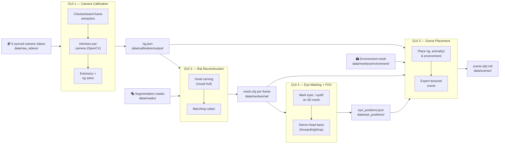

# 🐀 Rat 3D Reconstruction & First-Person View Toolkit

Markerless, multi-camera 3D reconstruction pipeline for freely-moving rats —
from raw checkerboard footage to a textured 3D scene and a reconstructed
**rat's-eye view**. Four self-contained browser GUIs, each backed by a small
local Python server, take you from a 6-camera rig to a placed, eye-tracked
3D scene without writing a line of code in between.

<p align="left">
  
  
  
  
  
</p>

> Add a screenshot or GIF of each GUI in `docs/images/` and drop it in below
> once you have one — a rig plot, a reconstructed mesh, and the scene
> placement view make this repo's landing page a lot more convincing.

---

## What this is

A rig of 6 synchronized cameras films an animal in an arena. This toolkit
turns that footage into:

1. a precise **camera rig calibration** (intrinsics + extrinsics),
2. a per-frame **3D mesh** of the animal via visual-hull carving,
3. a **placed 3D scene** (rig + environment + animal, in three.js), and
4. the animal's **eyes and head basis per frame**, i.e. the geometry needed
   to render what *the animal itself* would have seen — its first-person
   view (FPV/FOV).

Each stage is a standalone GUI (`gui_1` … `gui_4`) so you can run, inspect,
and re-run any single stage without touching the others. They talk to each
other only through plain files — JSON, PNG, OBJ, PLY — under [`data/`](data/).

## Pipeline



| Stage | GUI | Input | Output | Core method |
|---|---|---|---|---|
| 1 | [`gui_1_camera_calibration`](gui_1_camera_calibration) | 6 synced checkerboard videos | rig JSON + rig plots | OpenCV intrinsic/extrinsic calibration |
| 2 | [`gui_2_rat_reconstruction`](gui_2_rat_reconstruction) | rig JSON + per-camera silhouette masks | `mesh.obj` per frame | voxel carving + marching cubes (visual hull) |
| 3 | [`gui_3_scene_placement`](gui_3_scene_placement) | rig JSON + meshes + environment | textured scene export | interactive three.js placement |
| 4 | [`gui_4_eye_marking`](gui_4_eye_marking) | reconstructed mesh (`.ply`) | eye positions + head basis | manual 3D marking → geometric FOV |

## Repository structure

```
rat-3d-reconstruction/
├── gui_1_camera_calibration/   # Stage 1 — checkerboard calibration (OpenCV)
├── gui_2_rat_reconstruction/   # Stage 2 — visual-hull mesh reconstruction
├── gui_3_scene_placement/      # Stage 3 — three.js scene / rig placement
├── gui_4_eye_marking/          # Stage 4 — eye marking + first-person view
├── data/                       # shared workspace between all 4 GUIs (see data/README.md)
│   ├── raw_videos/camera_00{1..6}/
│   ├── calibration/{checkerboard_frames,output}/
│   ├── masks/rat_{1,2}/
│   ├── meshes/{rat,environment}/
│   ├── eye_positions/
│   └── scenes/
├── docs/images/                # screenshots / diagrams for this README
├── requirements.txt
└── LICENSE
```

Each GUI is *just files on disk* — a static `index.html` plus a
`ThreadingHTTPServer` that exposes a tiny JSON API (`/api/run`,
`/api/progress`, …) and serves results back to the page. No database,
no framework, no build step required to run stages 1, 2 and 4.

## Requirements

- Python 3.9+ with: `numpy`, `opencv-python`, `scipy`, `scikit-image`,
  `matplotlib` (see [`requirements.txt`](requirements.txt))
- Node.js ≥ 18 — only needed for GUI 3 (three.js scene viewer)
- A modern browser (Chrome/Firefox/Edge)

```bash
pip install -r requirements.txt
```

## Quickstart

Each GUI runs on its own port and is started independently:

```bash
# Stage 1 — camera calibration           → http://127.0.0.1:8971
python gui_1_camera_calibration/server.py

# Stage 2 — rat mesh reconstruction       → http://127.0.0.1:8972
python gui_2_rat_reconstruction/server.py

# Stage 3 — scene placement (three.js)    → http://127.0.0.1:8973
cd gui_3_scene_placement && npm install && npm run build && cd ..
python gui_3_scene_placement/env_marker_server.py

# Stage 4 — eye marking + FOV             → http://127.0.0.1:8974
python gui_4_eye_marking/eye_marker_server.py
```

Open the printed URL in your browser for whichever stage you're running.
Run stages 1 → 2 → 4 → 3 in order the first time through; after that,
each stage can be re-run independently against files already on disk.

---

## Stage 1 — Camera calibration

Turns 6 raw checkerboard videos into a full rig calibration.

1. Drop one synchronized video per camera into
   `data/raw_videos/camera_00{1..6}/`.
2. Start the server and open **http://127.0.0.1:8971**.
3. Set your checkerboard size (default `9×6` inner corners, `23 mm`
   squares), point each camera slot at its video file, pick a reference
   camera (default `camera_004`), and hit **Run**.
4. The pipeline runs in a background thread while the page polls
   `/api/progress` for live logs:
   - **Stage 1** — extract a diverse set of frames per camera and solve
     intrinsics (focal length, distortion) independently per camera.
   - **Stage 2** — extract frames where the checkerboard is visible to
     *all* cameras at once (synchronized frames).
   - **Stage 3** — solve extrinsics (each camera's pose relative to the
     reference camera) from those shared frames.
   - **Stage 4** — render a perspective and top-down plot of the solved
     rig for a sanity check.
5. Result: `data/calibration/output/<name>.json` — the rig file every
   later stage consumes — plus `rig_perspective.png` and
   `rig_top_view.png`.

<details>
<summary>Rig JSON convention</summary>

```jsonc
{
  "cameras": [
    {
      "name": "camera_004",
      "is_reference": true,
      "rotation_matrix": [[...]],   // R_world_to_cam:  p_cam = R @ p_world + t
      "translation_m":   [tx, ty, tz],
      "intrinsics": { "K": [[...]], "dist": [...] }
    },
    ...
  ]
}
```

Camera position in world space is derived as `-R.T @ t` wherever it's
needed (GUI 3's rig builder does exactly this).
</details>

## Stage 2 — Rat mesh reconstruction

Reconstructs a watertight 3D mesh of the animal for each frame from its
silhouette in all 6 views — a classic **shape-from-silhouette / visual
hull** approach.

1. Provide per-camera segmentation masks under `data/masks/`, in any of
   three layouts (auto-detected):
   - `masks/rat_<id>/frame_XXXXXX/<camera_name>.png`
   - `masks/frame_XXXXXX/cutouts/rat_<id>/<camera_name>.png`
   - `masks/<camera_name>/cutouts/rat_<id>/frame_XXXXXX.png`
2. Start the server, open **http://127.0.0.1:8972**, point it at your rig
   JSON from Stage 1 and your masks folder, choose a single frame or a
   range, and run.
3. For each frame: the animal's centroid is triangulated automatically
   from the masks (no manual seed point needed), a voxel grid around it is
   carved down using all camera silhouettes (`min_cameras` agreement
   required to keep a voxel), the largest connected component is kept, and
   **marching cubes** extracts the final surface. The raw marching-cubes
   surface is then smoothed (Taubin smoothing — removes the blocky voxel
   "staircase" look without shrinking the mesh, unlike plain Laplacian
   smoothing) before texturing.
4. Texturing (`texture_mode`, chosen in the UI):
   - **`atlas`** (default) — the mesh is cylindrically UV-unwrapped and a
     real texture image is baked by warping each face's best-camera view
     into its UV footprint (a per-triangle affine warp, chosen by which
     camera views that face most frontally). Written as a standard
     `mesh.obj` + `mesh.mtl` + `mesh_texture.png` — sharper than per-vertex
     colour (not bounded by mesh vertex spacing) and viewable in any
     OBJ-capable tool, macOS Preview/Quick Look included.
   - **`vertex_color`** — each vertex is reprojected into every camera and
     coloured from whichever cutouts see it as fur, written as a
     non-standard `v x y z r g b` OBJ extension (read by MeshLab,
     CloudCompare, Open3D, and Blender's OBJ importer — but *not* by
     simpler viewers, which will show untextured geometry instead).
   - **`none`** — geometry only.
5. Result: `data/meshes/rat/object_<id>/frame_XXXXXX/mesh.obj` (+ `.mtl` and
   `_texture.png` in `atlas` mode).

## Stage 3 — Scene placement

An interactive three.js viewer for composing the full 3D scene: camera
rig, environment mesh, and one or two reconstructed animals, each
independently movable, with the animal's eye direction rendered as a
first-person view cone.

1. Build the frontend once (or after editing `src/app.js`):
   ```bash
   cd gui_3_scene_placement && npm install && npm run build
   ```
2. Start `env_marker_server.py` and open **http://127.0.0.1:8973**.
3. Configure the session (rig JSON, environment mesh, animal mesh(es),
   eye-position files) via the panel — this is written to
   `session_config.json` (git-ignored, local to your machine).
4. The camera rig is placed automatically from the calibration JSON: each
   camera's world position/orientation is recovered from `R`/`t`, then
   everything is re-expressed in a **table-aligned display frame** derived
   from the rig's own average viewing direction — so the scene always
   opens looking sensibly at the table, regardless of how the rig was
   physically oriented during recording.
5. Drag/rotate the environment and animal mesh(es) into place with the
   on-screen transform gizmo, then **export** — writes a textured
   `scene.obj` + `.mtl` (+ copied textures) to
   `gui_3_scene_placement/exports/scene_<timestamp>/`.

## Stage 4 — Eye marking + first-person view

Manually mark eye positions on the reconstructed 3D mesh to recover the
animal's head basis and, from it, its point of view.

1. Point the tool at a mesh preview — either a single
   `.../frame_XXXXXX/mesh_preview.ply`, or a root folder plus a frame
   range following the same `frame_XXXXXX/` convention used everywhere
   else in the pipeline.
2. Start the server, open **http://127.0.0.1:8974**, and for each frame
   click the left eye, then the right eye, directly on the 3D mesh.
3. Save — writes `eyeL`, `eyeR`, and the derived `headForward` /
   `headRight` / `headUp` basis vectors to
   `data/eye_positions/eye_positions_<object_label>.json`, keyed by frame.

This head basis is exactly what Stage 3 needs to draw — and what any
downstream analysis needs to compute — the animal's own first-person view
of the scene.

---

## Data conventions

All shared inputs/outputs and exact folder layouts are documented in
[`data/README.md`](data/README.md). In short: `raw_videos` and
`environment` meshes are things you provide; `calibration`, `meshes/rat`,
`eye_positions` and `scenes` are generated by the pipeline and are
git-ignored (only `.gitkeep` placeholders are tracked).

## Design notes

A few things worth calling out if you're reading this as code, not just
running it:

- **Every long-running stage runs in a background thread** behind a tiny
  JSON API (`/api/run`, `/api/progress`) so the frontend can poll for
  live logs instead of holding an HTTP request open for a multi-minute
  calibration or reconstruction run.
- **No manual seed points.** The original scripts this was built from
  needed a hand-picked 3D seed point for reconstruction; Stage 2 now
  derives it automatically per frame by triangulating the masks' own
  centroids, using the same `p_cam = R @ p_world + t` convention used
  throughout the codebase.
- **Rig-relative, not room-relative.** Stage 3's display frame is derived
  purely from the calibration data itself (average camera viewing
  direction + least-squares intersection of optical axes for the table
  center), so any calibrated rig — not just one fixed physical setup —
  drops into the same viewer correctly oriented.
- **A rotation, not a reflection.** The coordinate remap between the
  calibration frame and three.js's Y-up frame is chosen to have
  determinant +1 — a plain axis swap can look right for positions alone
  while silently flipping handedness, which quietly breaks every camera's
  derived orientation.

## License

[MIT](LICENSE) — see the file for details.
